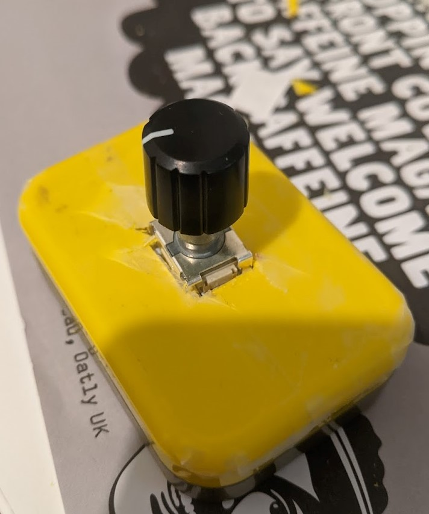

Use an [EC11 Rotary Encoder] and a [Raspberry Pi] Pico to control your
computer's volume.

[EC11 Rotary Encoder]:
    https://shop.pimoroni.com/products/ec11-rotary-encoder-module

[Raspberry Pi Pico]: https://shop.pimoroni.com/products/raspberry-pi-pico